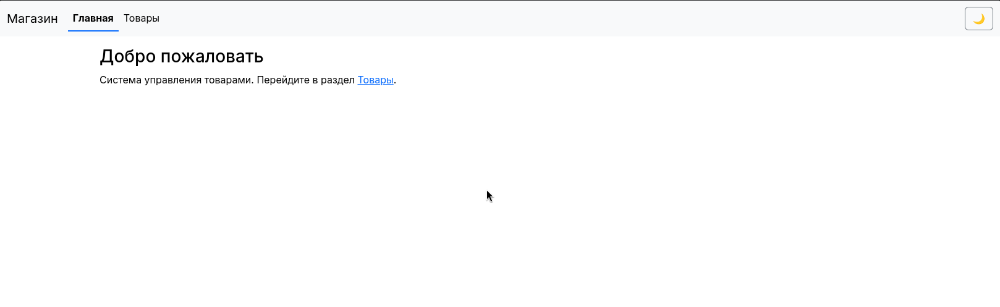
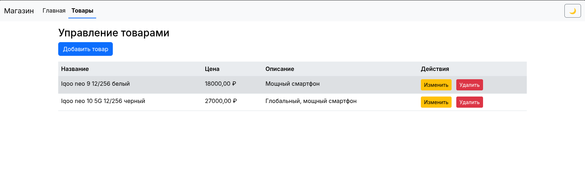
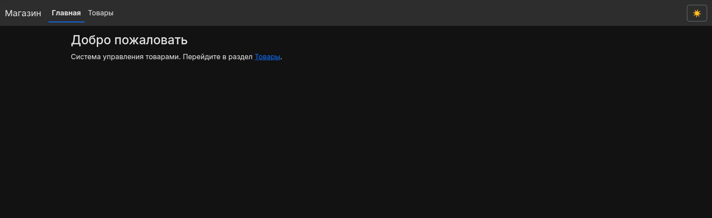
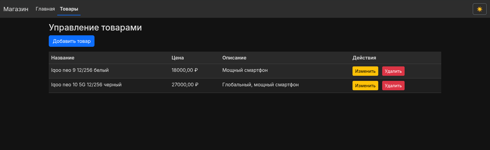

# Система управления товарами (Blazor WASM + ASP.NET Core API)

Клиент-серверное приложение для управления каталогом товаров интернет-магазина. Разработано в рамках дисциплины **«Программирование корпоративных систем»**. Реализует полный CRUD-цикл, двухуровневую валидацию, хранение в SQLite через EF Core и переключение светлой/тёмной темы с сохранением состояния.






##  Возможности
- ✅ Полный CRUD (создание, чтение, обновление, удаление товаров)
- ✅ Подтверждение удаления через браузерное диалоговое окно
- ✅ Валидация формы на клиенте (`EditForm`) и сервере (`ModelState.IsValid`)
- ✅ Хранение данных в SQLite с автоматическими миграциями EF Core
- ✅ Переключатель темы (Светлая / Тёмная) с сохранением в `localStorage`
- ✅ Адаптивный интерфейс на Bootstrap 5
- ✅ Архитектура, соответствующая принципам SOLID и DI

## 🛠 Технологический стек
- **Backend:** ASP.NET Core 9 Web API, Entity Framework Core 9 (SQLite)
- **Frontend:** Blazor WebAssembly (.NET 9), C#, Razor Components
- **UI/UX:** Bootstrap 5, CSS Variables (кастомные темы)
- **Инструменты:** .NET CLI, Git, SQLite
- **Архитектура:** RESTful API, Dependency Injection, Shared Model Pattern
/home/daniil/Документы/Pks/kr5/
## 📦 Требования
- [.NET 9 SDK](https://dotnet.microsoft.com/download/dotnet/9.0) (версия `9.0.115` или новее)
- IDE: JetBrains Rider / Visual Studio / VS Code (с расширением C# Dev Kit)
- Терминал: Bash / PowerShell / CMD

## ⚙️ Установка и настройка
1. Клонируйте репозиторий и перейдите в папку проекта:
   ```bash
   git clone https://github.com/ZenesDK/Client-Server-Blazor-WebAssembly
   cd Client-Server-Blazor-WebAssembly
   ```
2. Восстановите NuGet-пакеты:
   ```bash
   dotnet restore
   ```
3. Примените миграции для создания локальной БД (`products.db`):
   ```bash
   cd BlazorServer
   dotnet ef database update
   cd ..
   ```
   *(Если `dotnet ef` не найден: `dotnet tool install --global dotnet-ef`)*

## ▶️ Запуск приложения
Приложение состоит из двух независимых проектов. Запускайте их в **разных терминалах**:

**Терминал 1 — Сервер (API):**
```bash
cd BlazorServer
dotnet run
# API будет доступен по адресу: http://localhost:5096
```

**Терминал 2 — Клиент (Blazor WASM):**
```bash
cd BlazorClient
dotnet run
# UI откроется по адресу: http://localhost:5284
```
Откройте `http://localhost:5284` в браузере и перейдите в раздел **Товары**.

## 🌐 REST API Эндпоинты
Базовый адрес: `http://localhost:5096/api/products`

| Метод  | Endpoint              | Описание                                      |
|--------|-----------------------|-----------------------------------------------|
| `GET`  | `/api/products`       | Получить список всех товаров                  |
| `POST` | `/api/products`       | Добавить новый товар                          |
| `PUT`  | `/api/products/{id}`  | Обновить данные товара по ID                  |
| `DELETE`| `/api/products/{id}` | Удалить товар по ID                           |

## 📂 Структура проекта
```
├── BlazorServer/          # ASP.NET Core Web API (Backend)
│   ├── Controllers/       # ProductsController (CRUD + ModelState validation)
│   ├── Data/              # AppDbContext (EF Core)
│   ├── Migrations/        # Миграции SQLite
│   └── Program.cs         # Настройка DI, CORS, EF Core
── BlazorClient/          # Blazor WebAssembly (Frontend)
│   ├── Components/        # EditProduct.razor, ThemeSwitcher.razor
│   ├── Layout/            # MainLayout.razor
│   ├── Pages/             # Products.razor, Home.razor
│   ├── Services/          # IProductService, ProductService, ThemeService
│   ├── wwwroot/           # index.html, CSS, Bootstrap
│   └── Program.cs         # Регистрация HttpClient, DI
├── Shared/Models/         # Product.cs (модель + DataAnnotations валидация)
├── global.json            # Фиксация версии .NET SDK
└── .gitignore             # Исключение bin/, obj/, *.db, IDE-файлов
```

## 🏗 Архитектурные решения (SOLID & OOP)
- **Single Responsibility:** `ProductsController` отвечает только за HTTP-маршрутизацию и статусы. `ProductService` изолирует HTTP-логику. `ThemeService` управляет состоянием UI.
- **Open-Closed:** Интерфейс `IProductService` позволяет заменять реализацию (например, на кэширующий прокси) без изменения компонентов Blazor.
- **Liskov Substitution:** Клиентский сервис полностью заменяем на любую реализацию `IProductService`, сохраняя контракт методов.
- **Interface Segregation:** Сервис разделён на чёткие методы CRUD без избыточных операций.
- **Dependency Inversion:** Все зависимости внедряются через конструкторы и регистрируются в `Program.cs`. Клиент не зависит от конкретных типов `HttpClient`.
- **Validation:** Атрибуты `[Required]` и `[Range]` в `Shared/Models/Product.cs` обеспечивают проверку на обоих уровнях, предотвращая попадание некорректных данных в БД.

## 🐛 Решение частых проблем
| Проблема | Решение |
|----------|---------|
| Ошибка CORS | Убедитесь, что сервер запущен на `5096`, клиент на `5284`. Проверьте `app.UseCors()` в `BlazorServer/Program.cs`. |
| Тема сбрасывается после F5 | Очистите кэш браузера. Убедитесь, что `ThemeService` зарегистрирован в DI (`builder.Services.AddScoped<ThemeService>()`). |
| Миграции не применяются | Выполните `dotnet ef database update` строго из папки `BlazorServer`. |
| Поля формы не отображаются | Проверьте `_Imports.razor` на наличие `@using CorpProductSystem.Shared.Models`. |